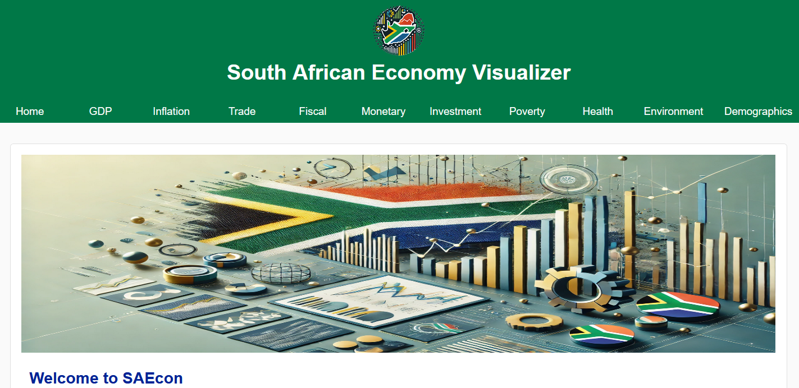

# SAEcon - South Africa Economic Indicators Visualization

SAEcon is a web-based application designed to visualize various economic metrics of South Africa. The application utilizes Flask, Pandas, and Plotly Express to display interactive charts and graphs, providing insights into different economic indicators.

## Introduction

SAEcon provides an intuitive platform for exploring and understanding South Africa's economic data. The interactive visualizations make it easy to analyze trends and make informed decisions based on the latest available data.

- **Deployed Site**: [SAEcon Live](https://saeconflaskapp.azurewebsites.net/)
- **Final Project Blog Article**: [SAEcon: Visualizing South Africa's Economy](http://example.com/blog)
- **Authors**:
  - [Keegan Joubert](https://www.linkedin.com/in/keegan-joubert/)

## Screenshot

## Installation

To set up the application, follow these steps:

1. **Clone the Repository**:   
- git clone https://github.com/Lekka141/SAEcon

2. **Navigate to the Project Directory**:
- cd SAEcon

3. **Install Dependencies**:

- pip install -r requirements.txt

4. **Run the Application**:
- flask run

5. **Usage**

Once the application is running, navigate to http://127.0.0.1:5000 in your web browser to access the dashboard. Use the navigation menu to explore different economic indicators such as GDP, Inflation, Trade, Fiscal, Monetary, Investment, Poverty, Health, Environment, and Demographics.
Contributing

## Contributions are welcome! Please fork the repository and create a pull request with your changes.

    Fork the repository
    Create your feature branch (git checkout -b feature/AmazingFeature)
    Commit your changes (git commit -m 'Add some AmazingFeature')
    Push to the branch (git push origin feature/AmazingFeature)
    Open a Pull Request.

## Licensing

This project is licensed under the MIT License. See the LICENSE file for more details.
Technical Details and Project Story

## The idea:

SAEcon started as a vision to simplify the understanding of South Africa's complex economic landscape. Inspired by the need for accessible data visualization tools, this project aims to bring clarity to the vast amounts of economic data available.
Challenges and Solutions

One of the main challenges was handling the large and diverse datasets. We leveraged the power of Pandas for data manipulation and Plotly Express for creating interactive and visually appealing charts. Flask was chosen as the web framework for its simplicity and robustness.
Future Iterations

## In future iterations, we plan to:

- Add more economic indicators and data sources.
- Improve the interactivity and usability of the charts.
- Implement user authentication to save and customize dashboard settings.

## Behind the Scenes

Creating SAEcon was a journey filled with learning and growth. From dealing with data inconsistencies to optimizing the performance of the visualizations, each step was a valuable experience. The project showcases not just technical skills but also the ability to think critically and solve complex problems.
Conclusion

SAEcon is more than just an application; it's a tool designed to empower users with knowledge and insights. We hope that this project inspires others to explore the world of data visualization and economic analysis.
